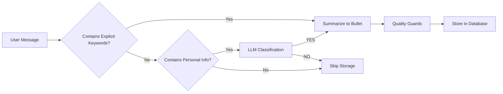

# Personal Fact Storage Pipeline

This document describes the implementation of the personal information storage pipeline that automatically captures and stores meaningful personal details from user conversations.

## Overview

The personal fact storage system implements a smart pipeline that:
- **Automatically detects** when users share personal information
- **Stores only relevant facts** using intelligent classification
- **Prevents duplicates** using semantic similarity matching
- **Protects privacy** with PII redaction
- **Manages storage** with automatic pruning

## How It Works

### 1. Detection Policy

The system stores information if:
- **Explicit keywords**: User says "remember", "save this", or "note this"
- **Personal information**: Contains new personal details about the user

### 2. Personal Information Categories

| Category | Examples | Why Important |
|----------|----------|---------------|
| **Identity & Profile** | Name, age, pronouns, birthday | Greeting & personalization |
| **Preferences** | Favorite color/food/music, hobbies, dislikes | Small-talk, suggestions |
| **Possessions** | Car/motorcycle model, pet names | Follow-up questions |
| **Plans & Commitments** | "I start a new job in August", "My wedding is on Oct 3rd" | Reminders |
| **Important Memories** | College stories, major life events | Richer relationships |

### 3. Processing Pipeline



#### Step 1: Explicit Keyword Detection
- Checks for: "remember", "save this", "note this"
- If found: **Always store** (bypasses classification)

#### Step 2: Fast Classification
Uses a lightweight LLM prompt:
```
Decide whether the USER sentence contains PERSONAL FACTS worth saving:

USER: "{sentence}"

Respond with exactly one token:
- YES  -> contains new personal info
- NO   -> does NOT contain personal info
```

#### Step 3: Summarization
Converts user messages to concise bullet points:
```
Rewrite the USER's sentence as one bullet starting with '• '. 
Keep concrete nouns & numbers; drop filler words.
```

#### Step 4: Quality Guards
- **PII Redaction**: Removes phone numbers, emails, SSNs, credit cards
- **Duplicate Detection**: Uses cosine similarity (threshold: 0.88)
- **Size Management**: Keeps max 200 snippets per user

## Usage Examples

### Example 1: Personal Story (Auto-detected)
```
👤 User: "I rode 450 miles overnight from Dallas to Auburn on my 650 cc Royal Enfield."
🤖 AI: "That sounds like an incredible journey!"

📝 Stored: "• Rode ~450 mi solo from Dallas → Auburn on a 650 cc Royal Enfield (overnight)."
```

### Example 2: Generic Question (Ignored)
```
👤 User: "What's the capital of Brazil?"
🤖 AI: "The capital of Brazil is Brasília."

🚫 Not stored: Generic factual question
```

### Example 3: Explicit Request (Always stored)
```
👤 User: "By the way, remember this: my wedding is 3 October 2026."
🤖 AI: "Congratulations! I'll remember that."

📝 Stored: "• Wedding is 3 October 2026."
```

## Database Schema

### Memory Snippets Table
```sql
CREATE TABLE memory_snippets (
    id BIGSERIAL PRIMARY KEY,
    user_id TEXT NOT NULL,
    content TEXT NOT NULL,
    importance INTEGER DEFAULT 7,
    created_at TIMESTAMPTZ DEFAULT NOW(),
    embedding JSONB
);
```

### Vector Search Function
```sql
CREATE FUNCTION match_memory_snippets(
    query_embedding JSONB,
    match_threshold FLOAT,
    match_count INT,
    user_id TEXT
) RETURNS TABLE(...);
```

## Configuration

### Environment Variables
```env
# Required for storage
USE_SUPABASE=true
SUPABASE_URL=your_supabase_url
SUPABASE_KEY=your_supabase_key

# Required for classification
GEMINI_API_KEY=your_gemini_key
```

### Tunable Parameters
```python
class ConversationManager:
    def __init__(self, user_id: str):
        # Storage limits
        self.max_snippets_per_user = 200
        
        # Duplicate detection threshold (0.0-1.0)
        self.similarity_threshold = 0.88
```

## Integration

### Server Integration
The pipeline automatically runs after each conversation:

```python
# Save conversation
await conversation_mgr.add_message("user", user_text)
await conversation_mgr.add_message("model", ai_response)

# Handle personal fact storage pipeline
await conversation_mgr.handle_user_turn(user_text, ai_response, llm_interface)
```

### Manual Usage
```python
from src.conversation import ConversationManager
from src.llm import LLM

# Initialize
conversation_mgr = ConversationManager("user_123")
llm_interface = LLM()

# Process a conversation turn
await conversation_mgr.handle_user_turn(
    user_msg="I love hiking in the mountains",
    assistant_msg="That sounds wonderful!",
    llm_interface=llm_interface
)
```

## Retrieval

### Semantic Search
```python
# Find relevant memories
snippets = await conversation_mgr.get_memory_snippets(
    query_text="What did I tell you about my hobbies?",
    max_results=5
)

for snippet in snippets:
    print(f"• {snippet['content']}")
```

### Profile Integration
Personal facts are separate from the existing user profile system:
- **User Profile**: Key-value facts (name, age, preferences)
- **Memory Snippets**: Contextual stories and experiences

## Testing

Run the test script to verify functionality:
```bash
python test_personal_facts.py
```

This will test:
- ✅ Explicit keyword detection
- ✅ Personal information classification  
- ✅ Summarization to bullet points
- ✅ PII redaction
- ✅ Duplicate detection
- ✅ Storage and retrieval

## Performance

### Classification Speed
- **Model**: Uses existing Gemini 1.5 Flash
- **Prompt**: ~50 tokens
- **Response**: 1 token (YES/NO)
- **Latency**: ~200-500ms

### Storage Efficiency
- **Embeddings**: 384-dimensional vectors
- **Storage**: ~1.5KB per fact
- **Pruning**: Automatic at 200 facts/user

## Privacy & Security

### PII Protection
- Phone numbers → `[PHONE]`
- Emails → `[EMAIL]`  
- SSNs → `[SSN]`
- Credit cards → `[CARD]`

### Data Retention
- Maximum 200 facts per user
- Oldest/lowest importance pruned first
- User can clear history anytime

### Access Control
- Facts isolated by user_id
- No cross-user data leakage
- Respects existing authentication

## Monitoring

### Logs
```
✅ Stored personal fact: • Has a golden retriever named Luna
⚠️ Skipping duplicate fact: • Dog Luna is a golden retriever  
🧹 Pruned 5 old facts for user_123
```

### Metrics
- Classification accuracy
- Storage hit rate
- Duplicate detection rate
- User engagement with memories

---

## Implementation Notes

This implementation follows the drop-in recipe pattern with:
- **Minimal dependencies**: Uses existing LLM and DB connections
- **Async-first**: All operations are non-blocking
- **Error resilient**: Graceful degradation if services unavailable
- **Production ready**: Includes proper logging and error handling

The pipeline integrates seamlessly with the existing conversation flow while adding powerful personal memory capabilities. 